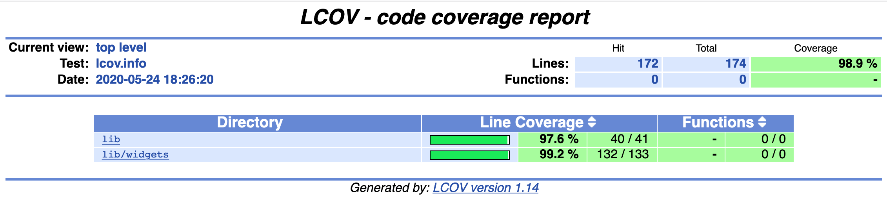

# Gratuity

A simple tip calculater built with Flutter.




## Run

[Install](https://flutter.dev/docs/get-started/install) Flutter

```
flutter run
```

## Test

```
flutter test
```

For help getting started with Flutter, view our
[online documentation](https://flutter.dev/docs), which offers tutorials,
samples, guidance on mobile development, and a full API reference.
